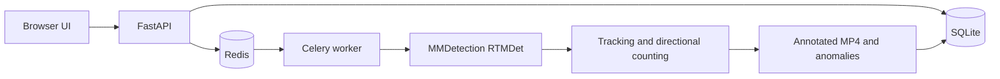

# Conveyor Bag Counter

An asynchronous conveyor-video bag counter built with **MMDetection / RTMDet**, **FastAPI**, **Celery**, and **Redis**. It detects bags in the supplied fixed-camera video, preserves identities across frames, counts each directional crossing once, and produces an annotated MP4 with audit anomalies.

## Quick start

1. Put the trained checkpoint at `models/rtmdet_bag.pth`.
2. Put the source video at `input.mp4`.
3. Start the stack:

   ```bash
   docker compose up --build
   ```

4. Open [http://localhost:8001](http://localhost:8001), upload the video, and start processing.

The API queues the job immediately; Celery performs the long-running inference in the background. When the job completes, download the annotated result from the UI.

## Final validated result

The final full-video run used the real `mmdet` backend and RTMDet checkpoint, never the bootstrap/reference detector.

| Measure | Result |
| --- | --- |
| Final MMDetection count | **127 bags** |
| Independent reference | **~130 passages** |
| Difference | **-3 (-2.3%)** |
| Validation bbox mAP / mAP@0.50 / mAP@0.75 / AR@100 | **0.785 / 0.981 / 0.922 / 0.840** |

The 14,999-frame annotated production result was visually inspected. Short real-MMDetection checks also matched the independent crossings: 20–32 s **4/4**, 180–192 s **1/1**, and 540–554 s **5/5**.

The checkpoint and annotated result are intentionally excluded from normal Git history: GitHub rejects normal Git blobs above 100 MB, while the final result video is approximately 120 MB. They are available from the [v1.0.1 release](https://github.com/antony502189-max/Model-MP4/releases/tag/v1.0.1): [checkpoint](https://github.com/antony502189-max/Model-MP4/releases/download/v1.0.1/rtmdet_bag.pth), [source video](https://github.com/antony502189-max/Model-MP4/releases/download/v1.0.1/input.mp4), [annotated result](https://github.com/antony502189-max/Model-MP4/releases/download/v1.0.1/conveyor_bag_counter_result.mp4), and [application demonstration](https://github.com/antony502189-max/Model-MP4/releases/download/v1.0.1/model_mp4_demo.mp4).

## Architecture



`./data` is mounted into both API and worker containers, so uploaded videos, job metadata, and results survive container recreation. `./models` is mounted separately for the checkpoint. Redis also uses a persistent named volume.

## Detection, tracking, and counting

Production inference explicitly calls `mmdet.apis.init_detector` with `models/rtmdet_bag.pth`, then `mmdet.apis.inference_detector` for each frame. The validated pipeline is:

```text
RTMDet → confidence filter → conveyor ROI → one-class post-ROI NMS
       → IoU tracker → bounded 3-frame prediction bridge
       → directional finite-line crossing → one-time counted flag
```

| Validated setting | Value |
| --- | --- |
| Detection confidence | 0.35 |
| Post-ROI NMS IoU | 0.35 |
| Count direction | `up` |
| Prediction bridge | 3 frames |
| Minimum crossing motion | 0.25 px |

The bags travel upward in image coordinates. Post-ROI NMS removes nested one-class RTMDet boxes before association; the short prediction bridge covers brief detector gaps at the line; and `Track.counted` prevents a track from incrementing the total twice. For a denser or less stable environment, ByteTrack or OC-SORT would be a reasonable tracker replacement.

`scripts/bootstrap_dataset.py`, `scripts/estimate_reference_count.py`, and `scripts/render_reference_preview.py` are **validation/bootstrap tooling only**. They are not production inference, and the ~130 independent reference never changes or forces the MMDetection count.

## Async execution and duplicate-job protection

`POST /api/jobs/{job_id}/start` returns HTTP `202` after queueing the work. Celery consumes the Redis task and periodically persists status, progress, count, anomalies, and processing FPS.

The worker uses a 12-hour Redis visibility timeout (`43200` seconds), plus an idempotency guard: only `queued` or explicitly `failed` jobs may start. A completed, cancelled, or already-processing job is skipped if Redis/Celery redelivers a message.

## Anomaly monitoring

Anomalies are persisted audit signals; they **do not alter the final count**. The final run recorded 34 events:

- `possible_stall`: 18
- `reverse_motion`: 6
- `heavy_occlusion`: 5
- `tracking_gap_near_line`: 5

## API workflow

| Action | Endpoint |
| --- | --- |
| Upload | `POST /api/videos` |
| Start async job | `POST /api/jobs/{job_id}/start` |
| Poll status | `GET /api/jobs/{job_id}` |
| Read anomalies | `GET /api/jobs/{job_id}/anomalies` |
| Download result | `GET /api/jobs/{job_id}/result` |

Examples are in [docs/API_EXAMPLES.md](docs/API_EXAMPLES.md). To reopen a known job in the UI, use `http://localhost:8001/?job=<job-id>`.

## Tests and verification

```bash
docker run --rm -e PYTHONPATH=/app -e DATA_DIR=/tmp/model-mp4-tests model-mp4:local python -m pytest -q
docker compose config --quiet
docker compose ps
```

The test suite covers API/worker lifecycle, post-ROI NMS, direction-aware anomalies, tracker bridging, and one-time line crossing. Architecture rationale and trade-offs are in [docs/TECHNICAL_DEFENSE.md](docs/TECHNICAL_DEFENSE.md).
