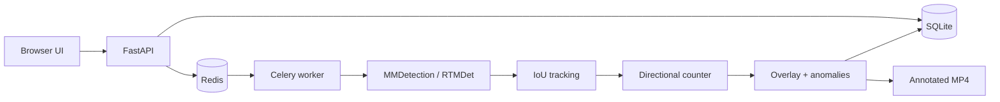
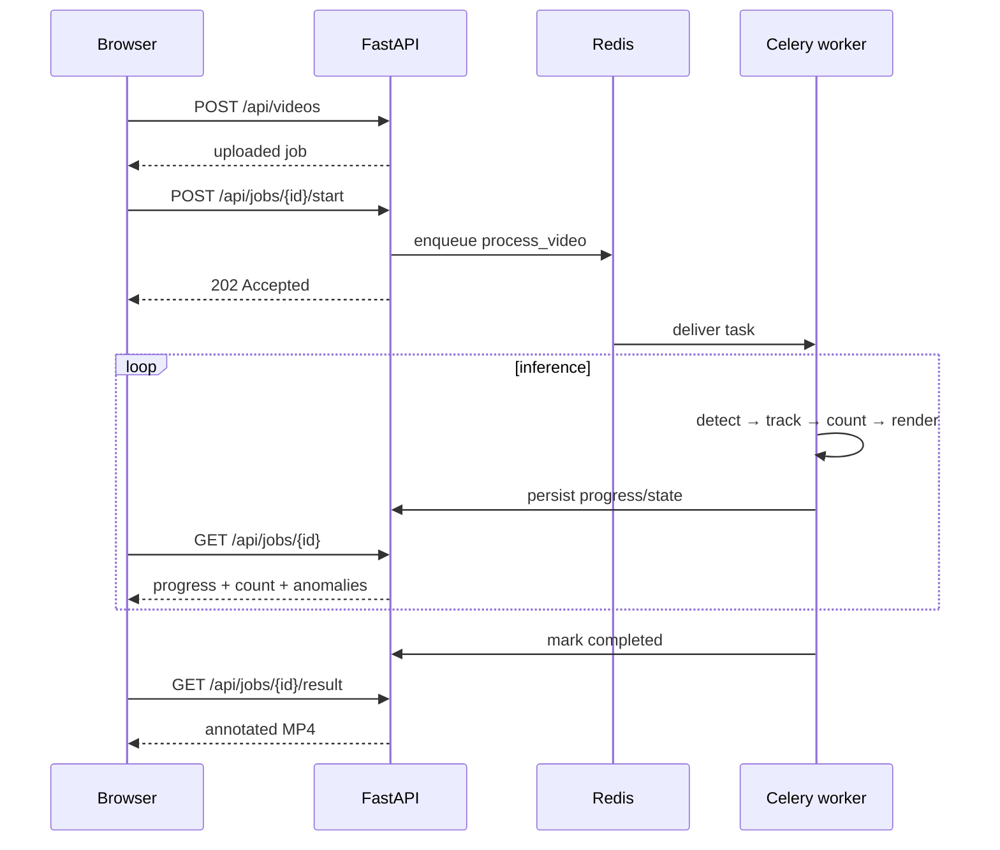

<div align="center">

# 🎯 Conveyor Bag Counter

### Production-style computer vision pipeline for conveyor analytics

<p>
  <a href="https://github.com/open-mmlab/mmdetection"></a>
  
  
  
  
</p>

**Detect bags → preserve identity → count valid crossings once → produce an auditable annotated video.**

<p>
  <a href="https://github.com/antony502189-max/Model-MP4/releases/tag/v1.0.1"></a>
  <a href="https://github.com/antony502189-max/Model-MP4/releases/download/v1.0.1/model_mp4_demo.mp4"></a>
  <a href="https://github.com/antony502189-max/Model-MP4/releases/download/v1.0.1/conveyor_bag_counter_result.mp4"></a>
  <a href="LICENSE"></a>
</p>

</div>

---

## ✨ What this project demonstrates

This repository is an end-to-end implementation of a real hiring assignment: process a fixed-camera conveyor video, detect bags with **MMDetection / RTMDet**, track them across frames, count each physical bag once, expose asynchronous processing through a web API, persist results, and surface suspicious tracking conditions as audit anomalies.

It is deliberately split into clear layers instead of hiding everything inside one inference script:

- **Detection** — one-class RTMDet inference through MMDetection.
- **Tracking** — deterministic IoU association with a bounded motion bridge.
- **Counting** — finite directional line crossing with one-time track protection.
- **Async execution** — FastAPI + Celery + Redis.
- **Persistence** — SQLite job state plus host-mounted videos/models.
- **Observability** — progress, processing FPS, anomaly events and annotated output.

---

## 📊 Final validated result

<div align="center">

| Metric | Result |
| :-- | --: |
| **Final MMDetection count** | **127 bags** |
| Independent reference | **~130 passages** |
| Absolute difference | **−3 bags** |
| Relative difference | **−2.3%** |
| bbox mAP | **0.785** |
| mAP@0.50 | **0.981** |
| mAP@0.75 | **0.922** |
| AR@100 | **0.840** |
| Final anomaly events | **34** |
| Frames processed | **14,999** |

</div>

> The production run used the real **MMDetection RTMDet** backend and the trained checkpoint. The bootstrap/reference detector was not used for production inference and the ~130 reference never modifies the model output or forces the final count.

Representative real-MMDetection short clips matched the independent crossing signal exactly:

- **20–32 s:** 4 / 4
- **180–192 s:** 1 / 1
- **540–554 s:** 5 / 5

---

## 🎬 Demo & release assets

Everything needed to inspect the submission is available in the public **[v1.0.1 release](https://github.com/antony502189-max/Model-MP4/releases/tag/v1.0.1)**.

| Asset | Purpose | Link |
| :-- | :-- | :-- |
| `model_mp4_demo.mp4` | Application / Docker demonstration | **[Watch / download](https://github.com/antony502189-max/Model-MP4/releases/download/v1.0.1/model_mp4_demo.mp4)** |
| `conveyor_bag_counter_result.mp4` | Final annotated production result | **[Download](https://github.com/antony502189-max/Model-MP4/releases/download/v1.0.1/conveyor_bag_counter_result.mp4)** |
| `rtmdet_bag.pth` | Fine-tuned one-class RTMDet checkpoint | **[Download](https://github.com/antony502189-max/Model-MP4/releases/download/v1.0.1/rtmdet_bag.pth)** |
| `input.mp4` | Supplied source video | **[Download](https://github.com/antony502189-max/Model-MP4/releases/download/v1.0.1/input.mp4)** |

Large binary artifacts live in the Release rather than ordinary Git history so the repository stays lightweight and avoids GitHub's 100 MB normal-blob limit.

---

## 🚀 Quick start

### 1. Place the required files

```text
models/rtmdet_bag.pth
input.mp4
```

Both are available from the [release](https://github.com/antony502189-max/Model-MP4/releases/tag/v1.0.1).

### 2. Start the stack

```bash
docker compose up --build
```

### 3. Open the UI

```text
http://localhost:8001
```

Upload `input.mp4`, create a job, then click **Start processing**. The HTTP request returns immediately while Celery performs inference in the background. When the job reaches `completed`, download the annotated result from the UI.

---

## 🏗️ Architecture



| Component | Responsibility |
| :-- | :-- |
| **FastAPI** | Upload, create/start jobs, status polling, anomaly endpoint, result download |
| **Redis** | Queue / broker and task backend |
| **Celery worker** | Long-running inference outside the HTTP request lifecycle |
| **MMDetection / RTMDet** | One-class `bag` detection for every frame |
| **IoU tracker** | Persistent object IDs across adjacent frames |
| **Directional counter** | Counts only valid finite-line crossings in the configured direction |
| **SQLite** | Durable job metadata, progress, metrics and anomaly state |
| **Mounted storage** | Persists uploads, results and checkpoint across container recreation |

---

## 🧠 CV pipeline

```text
RTMDet
  ↓
confidence filter
  ↓
conveyor ROI
  ↓
one-class post-ROI NMS
  ↓
IoU tracker
  ↓
bounded 3-frame prediction bridge
  ↓
directional finite-line crossing
  ↓
one-time counted flag
```

### Validated runtime parameters

| Setting | Value | Purpose |
| :-- | --: | :-- |
| Detection confidence | `0.35` | Preserve recall around the counting line |
| Post-ROI NMS IoU | `0.35` | Remove nested RTMDet boxes for the same bag |
| Tracker IoU threshold | `0.20` | Associate nearby detections frame-to-frame |
| Tracker max age | `18` frames | Keep IDs through short misses |
| Prediction bridge | `3` frames | Bridge brief detector dropout near the line |
| Count direction | `up` | Matches the real conveyor motion in image coordinates |
| Minimum crossing motion | `0.25 px` | Avoid rejecting legitimate small sub-pixel crossings |

### Why the extra NMS?

The trained RTMDet occasionally emitted nested one-class boxes for a single visible bag. Those boxes could become separate tracks and generate false overlap/anomaly events. A simple post-ROI NMS keeps the strongest box before tracking.

### Why the short prediction bridge?

A real bag can briefly disappear for one or two frames near the counting line. The tracker therefore propagates the last estimated velocity for at most three frames. The bound is intentionally short: it bridges genuine detector gaps without inventing long trajectories.

### Why each bag is counted once

Every track owns a persistent `counted` flag. A count event requires:

1. the trajectory to change side of the configured finite line;
2. the crossing point to lie on the line segment, not its infinite extension;
3. the motion to match the configured conveyor direction;
4. the track not to have been counted before.

Once the event fires, the track can never increment the total again.

---

## ⚙️ Real MMDetection inference

Production inference is explicit and auditable:

```python
from mmdet.apis import inference_detector, init_detector

model = init_detector(config, checkpoint, device=device)
result = inference_detector(model, frame)
```

The model configuration is in [`mmdet_configs/rtmdet_tiny_bag.py`](mmdet_configs/rtmdet_tiny_bag.py). It adapts RTMDet-tiny to a single `bag` class and uses a 60-epoch schedule appropriate for this compact fixed-camera dataset.

Bootstrap tooling remains isolated under `scripts/` and is used only for dataset/reference preparation. It is **not** the production detector.

---

## ⏱️ Asynchronous processing



A 12-hour Redis visibility timeout protects long CPU inference from premature redelivery. The worker also applies an idempotency guard: completed, cancelled or already-processing jobs do not accidentally start a second full render.

---

## 🚨 Anomaly monitoring

Anomalies are **audit signals**, not automatic corrections to the count.

| Type | Final events | Meaning |
| :-- | --: | :-- |
| `possible_stall` | 18 | Object remains almost stationary for an unusual duration |
| `reverse_motion` | 6 | Track moves opposite to the expected conveyor direction |
| `heavy_occlusion` | 5 | Strong overlap between tracks can make association ambiguous |
| `tracking_gap_near_line` | 5 | Temporary tracking loss close to the counting line |

The final run contains **34** persisted anomaly events. They are shown in the UI and available through the API for manual review.

---

## 🌐 API

| Action | Endpoint |
| :-- | :-- |
| Health | `GET /api/health` |
| Upload video | `POST /api/videos` |
| Start async processing | `POST /api/jobs/{job_id}/start` |
| Poll job | `GET /api/jobs/{job_id}` |
| Read anomalies | `GET /api/jobs/{job_id}/anomalies` |
| Download result | `GET /api/jobs/{job_id}/result` |

See [`docs/API_EXAMPLES.md`](docs/API_EXAMPLES.md) for request examples.

---

## 💾 Persistence & Docker

The normal startup path is intentionally one command:

```bash
docker compose up --build
```

The Compose stack contains:

```text
api       FastAPI / Uvicorn
worker    Celery
redis     Redis 7
trainer   optional training profile
```

Persistent mounts keep the important state outside ephemeral containers:

```text
./data      → /data
./models    → /models
./dataset   → /dataset
./work_dirs → /work_dirs
```

Redis uses its own named persistent volume.

---

## 🧪 Verification

```bash
# after building the image
docker run --rm \
  -e PYTHONPATH=/app \
  -e DATA_DIR=/tmp/model-mp4-tests \
  model-mp4:local python -m pytest -q

docker compose config --quiet
docker compose ps
```

The test suite covers:

- API and worker lifecycle;
- video validation;
- post-ROI NMS;
- tracker identity and short-gap bridging;
- directional crossing behavior;
- one-time counting invariant;
- direction-aware anomaly monitoring;
- Celery task behavior.

---

## 📁 Repository map

```text
Model-MP4/
├── app/
│   ├── api/                 # FastAPI endpoints
│   ├── cv/                  # detector, tracker, counter, anomalies, rendering
│   ├── services/            # storage and job-state helpers
│   ├── static/              # web UI assets
│   └── templates/           # HTML template
├── worker/                  # Celery app and video-processing task
├── mmdet_configs/           # one-class RTMDet training/inference config
├── scripts/                 # bootstrap, reference and debugging utilities
├── tests/                   # unit/integration tests
├── docs/                    # API examples and technical defense
├── data/                    # persisted uploads/results (ignored in Git)
├── models/                  # trained checkpoint (release asset)
├── docker-compose.yml
├── Dockerfile
└── README.md
```

---

## 🔍 Engineering decisions & trade-offs

<details>
<summary><b>Why RTMDet-tiny?</b></summary>

The assignment requires MMDetection. RTMDet-tiny gives a practical accuracy/latency trade-off for a fixed-camera, single-class task while remaining small enough to fine-tune and run on CPU-only development hardware.

</details>

<details>
<summary><b>Why not count detections frame-by-frame?</b></summary>

A physical bag is visible in many consecutive frames. Counting raw detections would overcount the same object repeatedly. Detection, tracking and counting are therefore separate stages.

</details>

<details>
<summary><b>Why not ByteTrack?</b></summary>

ByteTrack or OC-SORT would be strong choices for a denser production conveyor. For this fixed camera, the small deterministic IoU tracker remained easy to audit and achieved correct short-clip crossings after duplicate suppression and bounded gap bridging. The tracker interface is isolated so it can be replaced without rewriting the counter.

</details>

<details>
<summary><b>Why SQLite?</b></summary>

This assignment uses a single worker and a single-node deployment, so SQLite keeps infrastructure minimal while still persisting job state. For multiple concurrent workers, PostgreSQL would be the natural upgrade.

</details>

<details>
<summary><b>What would change in a larger production deployment?</b></summary>

- GPU inference / batching where latency permits;
- ByteTrack or OC-SORT, optionally with appearance embeddings;
- PostgreSQL for multi-worker concurrency;
- object storage for source/results;
- dedicated metrics/logging stack;
- model/version registry and dataset lineage;
- evaluation with IDF1/HOTA in addition to detector AP.

</details>

For the complete interview-oriented rationale, see **[`docs/TECHNICAL_DEFENSE.md`](docs/TECHNICAL_DEFENSE.md)**.

---

<div align="center">

### Model-MP4

**MMDetection × RTMDet × FastAPI × Celery × Redis × Docker**

[Release](https://github.com/antony502189-max/Model-MP4/releases/tag/v1.0.1) · [Demo](https://github.com/antony502189-max/Model-MP4/releases/download/v1.0.1/model_mp4_demo.mp4) · [Final video](https://github.com/antony502189-max/Model-MP4/releases/download/v1.0.1/conveyor_bag_counter_result.mp4)

</div>
